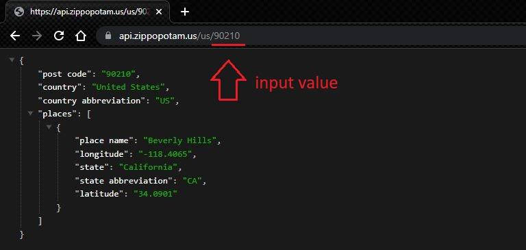

# Two API's, One Sun
## **Description**
We built this webpage in order to create a quick and easy way for a user to access what time the sun will be rising or setting in their area. We realized that most people guess at what time these events take place and this webpage will solve that issue. All it takes is entering a zip code and a user will get location information and the specific time they can catch a sunrise or sunset.
## **Table of Contents**
- [**Installation**](#installation)
- [**Usage**](#usage)
- [**Credits**](#credits)
- [**License**](#license)
- [**Technologies**](#technologies)
## **Installation**
No installation steps are required. This application may be visited at ***https://calebgdavidson.github.io/Group-Project1/***
## **Usage**
**How it works:**
  **Step 1:** We begin by setting up our modal to accept an input value for any valid zip code in the united states.  Enter a zip code and press the "Submit" button.
 
  **Step 2:** That input value is entered into a function that adds it to the url query to generate JSON returned data. 
 
 The following results will appear:
 
  **Step 3:**
 Now that you have obtained the information for your zip code, press the following button
 
 Next the latitude and longitude values retrieved from the Zippopotam.us API are stored into variables. These are then used to provide query parameters for the Sunrise Sunset API.
 
 The following results will be displayed in the second window:
 
  **Step 4:**
 If you'd like to search a new zip code, press the following button.
 
  **Step 5:**
 Feel free to visit our teams links
 
## **Credits**
 **Caleb Davidson**
 ***https://github.com/calebgdavidson***
 **Geneveve Perez**
 ***https://github.com/genrp24***
 **Sam O'Cain**
 ***https://github.com/samocain93***
 **Matthew Wessman**
 ***https://github.com/JimblesMw***
 **James Kelly**
 ***https://github.com/jk377y***
 **The Coding Train** ***https://www.youtube.com/watch?v=uxf0--uiX0I*** For technical assistance and walkthrough of working with data and APIs in JavaScript
 **Web Dev Tutorials** ***https://www.youtube.com/watch?v=uUCpopjPZdI*** For technical assistance and walkthrough of modal building.
 **Web Dev Simplified** ***https://www.youtube.com/watch?v=NIq3qLaHCIs*** For technical assistance and walkthrough of object deconstruction.
## **License**
 MIT License

Copyright (c) 2022 James Kelly

Permission is hereby granted, free of charge, to any person obtaining a copy
of this software and associated documentation files (the "Software"), to deal
in the Software without restriction, including without limitation the rights
to use, copy, modify, merge, publish, distribute, sublicense, and/or sell
copies of the Software, and to permit persons to whom the Software is
furnished to do so, subject to the following conditions:

The above copyright notice and this permission notice shall be included in all
copies or substantial portions of the Software.

THE SOFTWARE IS PROVIDED "AS IS", WITHOUT WARRANTY OF ANY KIND, EXPRESS OR
IMPLIED, INCLUDING BUT NOT LIMITED TO THE WARRANTIES OF MERCHANTABILITY,
FITNESS FOR A PARTICULAR PURPOSE AND NONINFRINGEMENT. IN NO EVENT SHALL THE
AUTHORS OR COPYRIGHT HOLDERS BE LIABLE FOR ANY CLAIM, DAMAGES OR OTHER
LIABILITY, WHETHER IN AN ACTION OF CONTRACT, TORT OR OTHERWISE, ARISING FROM,
OUT OF OR IN CONNECTION WITH THE SOFTWARE OR THE USE OR OTHER DEALINGS IN THE
SOFTWARE.
## **Technologies**
 **1). Bulma CSS styling Framework**
 ***https://bulma.io/documentation/layout/tiles/***
 ***https://www.youtube.com/watch?v=LBzZLzu2GKo***
 
  **2). Zippopotam.us Zip Code Galore! API**
 ***https://api.zippopotam.us/***
 
  **3). Sunset and Sunrise Times API**
 ***https://sunrisesunset.io/api/***
 
  **4). Google Slides - used to preplan our project**
 ***https://docs.google.com/presentation/u/0/***
 Phase 1: 

 Phase 2: 

